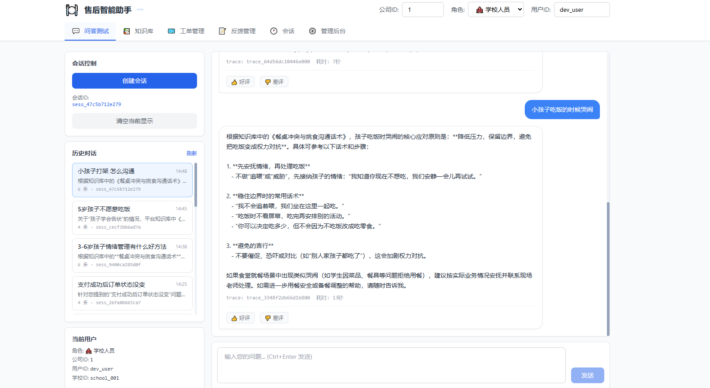
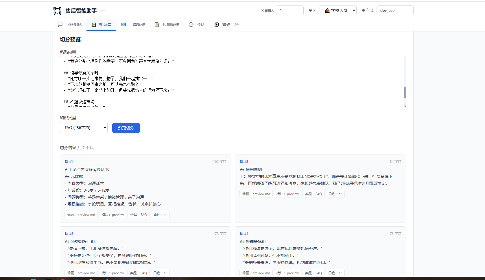
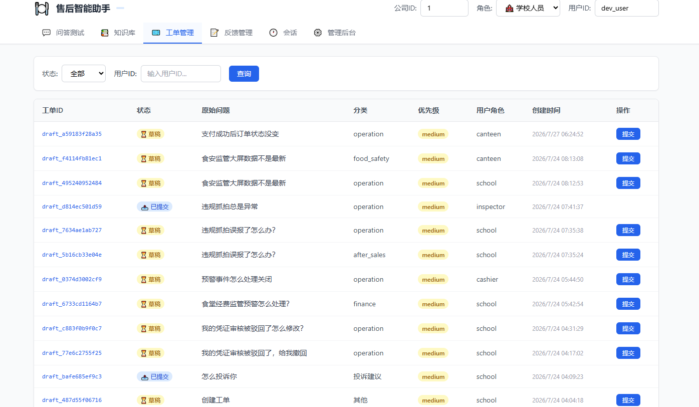
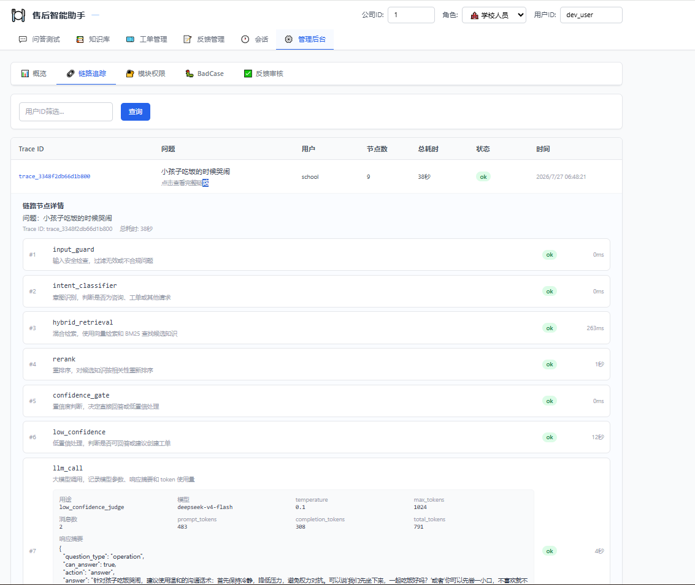
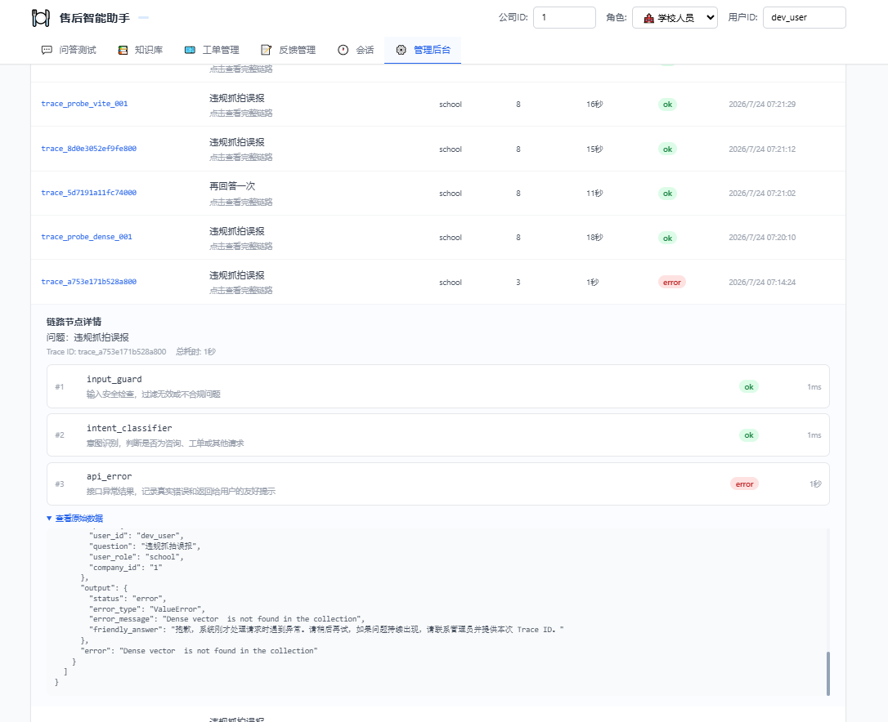

# 售后智能助手

面向学校食堂、教育局、食堂人员、财务、配送商等角色的售后智能问答系统。项目支持知识库检索问答、工单草稿、反馈审核、BadCase 管理、链路追踪、多租户隔离、角色模块权限配置和会话历史持久化。

## 项目实现







### 整体架构

```text
Vue/Vite 前端
  -> FastAPI 后端
  -> RAG 引擎
  -> Qdrant dense + BM25 混合检索
  -> SiliconFlow Rerank
  -> DeepSeek LLM 生成答案
```

核心服务：

- 前端：Vue 3、Vite、Pinia、Axios、Tailwind CSS
- 后端：FastAPI、SQLAlchemy Async、Pydantic Settings
- 数据库：PostgreSQL，保存工单、反馈、链路、会话历史、角色模块权限等
- 缓存：Redis，保存短期会话记忆和中期摘要
- 向量库：Qdrant
- Embedding：SiliconFlow `BAAI/bge-large-zh-v1.5`
- Rerank：SiliconFlow `BAAI/bge-reranker-v2-m3`
- LLM：DeepSeek 官方 API `deepseek-v4-flash`

### 主要功能

- 智能问答：基于知识库检索后生成回答
- 混合检索：向量检索 + BM25 sparse 检索 + RRF 融合
- Rerank 排序：对召回候选再次排序
- 知识库管理：上传 Markdown、切分预览、检索测试、文档列表、详情查看、删除、重建索引
- 工单管理：低置信度或明确工单意图时生成工单草稿
- 反馈管理：好评、差评、BadCase 候选、审核
- 链路追踪：按每次问题展示 Trace ID、节点耗时、LLM 参数、响应摘要和错误详情
- 历史会话：会话列表持久化，点击历史会话可回显并继续问答
- 多租户：默认 `company_id=1`，知识库、问答、工单、反馈、链路、会话按租户隔离
- 权限配置：管理后台支持配置角色可访问的知识库模块
- 提示词管理：System Prompt 等通过 Jinja2 模板版本化，支持 A/B 测试与热重载
- RAGAS 评测：管理后台内置评测服务，另有命令行端到端评测脚本

## 核心技术点

### 1. RAG 检索链路

```text
用户问题
  -> 输入安全检查
  -> 意图识别
  -> 查询改写
  -> dense embedding
  -> BM25 sparse embedding
  -> Qdrant hybrid 检索
  -> SiliconFlow rerank
  -> 置信度判断
  -> DeepSeek LLM 生成答案
  -> 输出安全处理
  -> 返回前端并记录 Trace
```

### 2. 混合检索

Qdrant collection 使用两个向量字段：

```text
dense: 语义向量
bm25: 稀疏向量
```

入库时，每个知识 chunk 同时写入 dense 向量和 BM25 sparse 向量。检索时同时召回，再用 Qdrant RRF 融合。

### 3. 知识库切分

不使用 LangChain 的 `RecursiveCharacterTextSplitter`，而是自定义 Markdown 规则 + token 感知切分。

默认知识库目录：

```text
knowledge_base/
  faq/
  manual/
```

切分规则：

- FAQ：按 `## Q1:`、`## Q2:` 问答对切分（每个问答对一个 chunk）
- 操作手册：按 `### 1.`、`### 2.` 章节切分
- 超长 chunk：用 BGE tokenizer 按 400 token（50 token 重叠）二次切分，避免超过 embedding 上限

### 4. 多租户隔离

所有请求默认带：

```text
company_id=1
```

隔离点：

- 前端请求头：`X-Company-Id`
- PostgreSQL 表字段：`company_id`
- Qdrant payload：`company_id`
- Redis key：`company:{company_id}:session:{session_id}:...`
- 检索过滤：Qdrant 按 `company_id` 过滤

### 5. 会话记忆

项目采用：

```text
滑动窗口短期记忆 + 中期摘要记忆 + 全量会话持久化
```

具体逻辑：

- PostgreSQL：保存完整聊天历史，用于历史会话回显
- Redis 短期记忆：只保留当前会话最近 5 轮问答
- Redis 中期摘要：超过 5 轮后，被挤出的旧问题会压缩进摘要
- LLM Prompt：只加载中期摘要 + 最近 5 轮问答

### 6. 角色模块权限

管理后台可以配置：

```text
角色 -> 可访问模块
```

问答检索时会根据当前用户角色生成模块过滤条件。管理员默认全模块可见。保存权限后，不需要重新入库，后续新问题立即生效。

### 7. Prompt 管理与版本化

System Prompt 等提示词不再硬编码，统一用 Jinja2 模板 + 版本目录管理：

```text
backend/prompts/
  system/food_safety_expert.j2        # 主 System Prompt（根目录兜底）
  classifier/intent_v1.j2             # 意图分类器
  user/default.j2                     # 用户消息模板
  context/standard.j2                 # 上下文组装（standard/citation/compact）
  versions/v1.0.0/                    # 版本化模板（实际生效）
```

核心能力：

- 版本切换：`prompt.default_version` 指定默认版本，回退链为「指定版本 → 默认版本 → 根目录兜底」
- A/B 测试：`prompt.ab_test.enabled` 开启后，按 `session_id` 哈希把部分流量分流到 `new_version`
- 热重载：`prompt.hot_reload=true` 时每次读取模板文件，开发调试无需重启
- 上下文组装三种模式：`standard` / `citation`（带 [N] 引用标注）/ `compact`（精简）

Prompt 注入防护共 4 层：输入清洗、提示词结构隔离、知识库内容清洗、输出泄露检测。

## 已做优化点

- 意图识别规则优先：
  - 明确命中创建工单、报修、投诉、转人工，直接生成工单草稿
  - 明确问候、测试、闲聊，直接返回固定答复
  - 普通业务问题默认进入问答，不调用 LLM 做意图判断
  - 只有非常模糊的问题才调用 LLM 判断
- 前端超时调整为 180 秒
- 错误响应友好化，不把底层异常直接展示给用户
- 每次请求生成 Trace ID，方便后台排查
- 链路追踪按问题聚合，不再平铺节点
- LLM 调用记录模型、base_url、temperature、max_tokens、token usage、响应摘要和耗时
- 检索测试可直观看到 dense、BM25、RRF hybrid、rerank 四阶段结果
- 知识库文档列表支持总文件数、总 chunk 数、点击查看详情
- 上传同一 `company_id + 知识类型 + 模块 + 文件名` 时，先删除旧 chunks 再重新入库，避免重复数据
- Qdrant payload 增加 `company_id`，支持多租户过滤
- 角色模块权限改为可配置，并接入实际 RAG 检索
- 会话历史完整持久化，但 LLM 只使用最近 5 轮上下文，控制 token 成本

## RAGAS 评测

项目内置评测能力，用于回归验证检索与回答质量：

- 管理后台 RAGAS 看板：`backend/app/core/ragas_eval_service.py` 提供进程内评测服务
- 命令行端到端评测：`scripts/run_ragas_eval.py`、`scripts/run_parenting_ragas_eval.ps1`
- 数据集生成：`scripts/generate_parenting_ragas_dataset.py`

评测数据集位于 `data/rag_evaluation/`（含 RAGAS 所需的 `question` / `ground_truth` / `reference_contexts`），RAGAS 依赖见 `requirements-eval.txt`。快速上手见 `data/rag_evaluation/README.md`。

## Windows 本地执行

### 1. 准备环境

建议环境：

- Python 3.10+
- Node.js 18+
- PostgreSQL 16 或兼容版本
- Redis 7+

本地开发时 Qdrant 默认使用 embedded local 模式，数据目录：

```text
backend/qdrant_data
```

### 2. 配置环境变量

复制环境变量模板：

```powershell
cd D:\AI_Projects\food-safety-assistant
Copy-Item .env.example .env
```

至少填写：

```text
DEEPSEEK_API_KEY=你的 DeepSeek 官方 API Key
SILICONFLOW_API_KEY=你的 SiliconFlow API Key
PG_HOST=localhost
PG_PORT=5432
PG_USER=postgres
PG_PASSWORD=你的 PostgreSQL 密码
PG_DB=food_safety
REDIS_HOST=localhost
REDIS_PORT=6379
REDIS_PASSWORD=你的 Redis 密码
DEFAULT_COMPANY_ID=1
```

### 3. 启动后端和前端

一键启动：

```powershell
cd D:\AI_Projects\food-safety-assistant
.\start.ps1
```

手动启动后端：

```powershell
cd D:\AI_Projects\food-safety-assistant\backend
pip install -r requirements.txt
uvicorn app.main:app --host 0.0.0.0 --port 5002 --reload
```

手动启动前端：

```powershell
cd D:\AI_Projects\food-safety-assistant\frontend
npm install
npm run dev
```

访问地址：

```text
前端：http://localhost:5173
后端：http://localhost:5002
API 文档：http://localhost:5002/docs
```

### 4. 初始化知识库

首次运行或重建 Qdrant schema 时，先停止后端，再执行：

```powershell
cd D:\AI_Projects\food-safety-assistant
$env:PYTHONIOENCODING="utf-8"
$env:PYTHONPATH="D:\AI_Projects\food-safety-assistant\backend"
python -m scripts.ingest --recreate --company-id 1
```

只预览切分，不写入 Qdrant：

```powershell
python -m scripts.ingest --dry-run --company-id 1
```

## Linux Docker 部署

### 1. 准备环境

服务器建议：

- 2C/4G 起步，推荐 4C/8G
- Docker
- Docker Compose v2

拉取代码：

```bash
git clone https://github.com/Asenli/AI_RAG_PROJECTS.git
cd AI_RAG_PROJECTS
```

### 2. 配置 `.env`

```bash
cp .env.example .env
vim .env
```

至少填写：

```bash
DEEPSEEK_API_KEY=你的 DeepSeek 官方 API Key
SILICONFLOW_API_KEY=你的 SiliconFlow API Key
PG_PASSWORD=强密码
REDIS_PASSWORD=强密码
MINIO_SECRET_KEY=强密码
JWT_SECRET=强随机字符串
DEFAULT_COMPANY_ID=1
COMPANY_ID=1
```

### 3. 启动服务

```bash
docker compose up -d --build
```

查看状态：

```bash
docker compose ps
```

查看日志：

```bash
docker compose logs -f backend
docker compose logs -f frontend
```

访问地址：

```text
前端：http://服务器IP:5001
后端：http://服务器IP:5002
API 文档：http://服务器IP:5002/docs
```

### 4. Docker 初始化知识库

首次部署后执行：

```bash
docker compose exec backend python -m scripts.ingest \
  --kb-root /app/knowledge_base \
  --recreate \
  --company-id 1
```

后续只新增其他租户知识时，不要使用 `--recreate`：

```bash
docker compose exec backend python -m scripts.ingest \
  --kb-root /app/knowledge_base \
  --company-id 2
```

### 5. 常用运维命令

停止服务但保留数据：

```bash
docker compose down
```

停止服务并删除所有持久化数据：

```bash
docker compose down -v
```

重建后端：

```bash
docker compose up -d --build backend
```

重建前端：

```bash
docker compose up -d --build frontend
```

## 常见问题

### Dense vector is not found in the collection

说明 Qdrant collection 是旧 schema，缺少 `dense` 或 `bm25`。处理方式：

```bash
python -m scripts.ingest --recreate --company-id 1
```

本地 embedded Qdrant 重建前请先停止后端。

### 切换 LLM 是否需要重新入库

不需要。只有以下情况需要重新入库：

- 知识库文件变化
- embedding 模型变化
- Qdrant schema 变化
- 需要补充或修正 `company_id` payload

### 页面上传和批量入库有什么区别

两者最终都会写入 Qdrant 的 dense + BM25 schema。页面上传会标记：

```text
upload_channel=manual_upload
```

相同 `company_id + 知识类型 + 模块 + 文件名` 重复上传时，会覆盖旧 chunks，不会重复累加。

## 更多部署细节

更详细的部署、排查和命令说明见：

```text
DEPLOY.md
```
